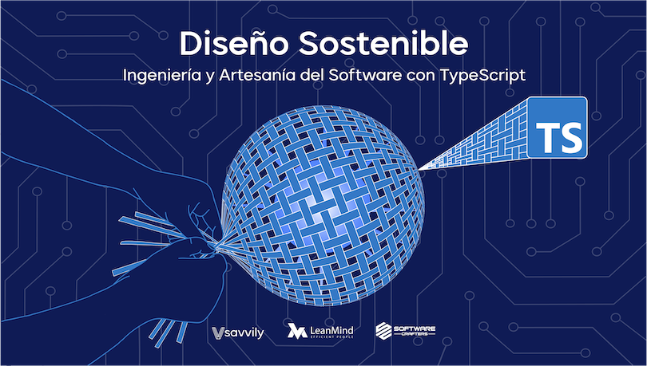

# Softwarecrafters - [Curso Diseño Sostenible](https://diseñosostenible.com)

## Kata Markdown Transformer

>**NOTA:** Plantilla para construir la base inicial del proyecto [aquí](https://github.com/softwarecrafters-io/ts-eslint-prettier-jest).

Ejercicio que propone un problema a solucionar utilizando el desarrollo dirigido por tests, aplicando conceptos como:
- Inyección e inversión de dependencias.
- Principio de sustitución de Liskov.
- Segregación de interfaces.

Se pretende construir un servicio que realice la transformación sobre texto en formato markdown.
El problema a resolver se encuentra en los enlaces a sitios web, dado que se pretenden imprimir el texto en formato digital (PDF, ePUB) y en formato analógico (papel).
En caso de formato papel, se utilizará la anotación a pie de página para mostrar la URL del enlace asociado.

---

* TypeScript
* Jest
* ESLint
* Prettier
* Husky

---
* `nvm use`
* `npm install`
* `npm test`

